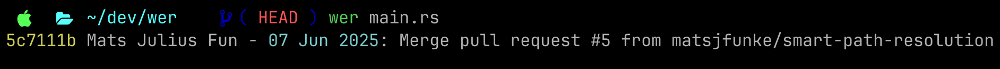
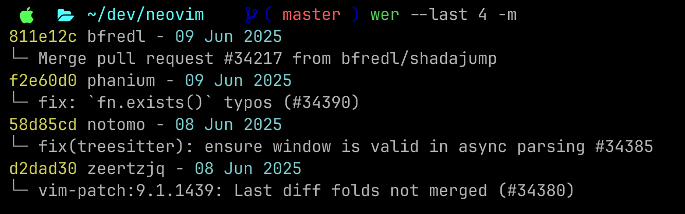
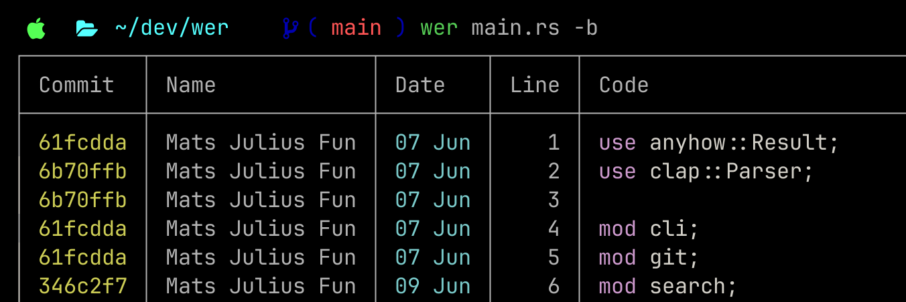
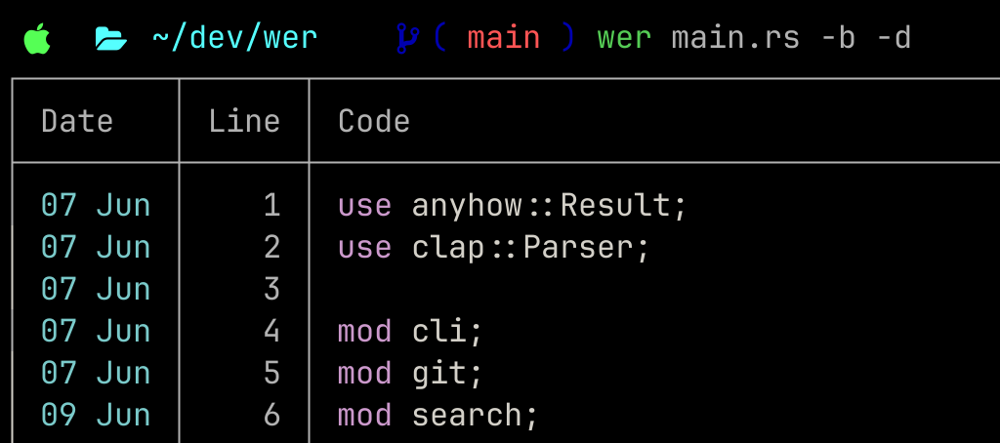

# ⁉️ wer ⁉️

`wer` (German "who") is a command-line tool for answering that everyday question:

> _Who touched this last?!_

No more complex `git log` commands, no more hunting for exact file paths. `wer` gives you context aware file / directory search.
`wer` offers both file-level recency and line-specific history through its `blame mode`, bridging the gap between `git blame` and `git-who` plus offering features like smart file finding and syntax highlighting.



## 🚀 Quick Start

```bash
# install wer
cargo install wer

# Find who last edited any file
wer main.rs

# Show last 3 contributors to a directory
wer -l 3 src/
```

## : 📦 Installation

**From crates.io (Recommended)**

```bash
#install cargo
curl https://sh.rustup.rs -sSf | sh
# install wer crate
cargo install wer
```

**From Source**

```bash
#install cargo
curl https://sh.rustup.rs -sSf | sh
# clone repository
git clone https://github.com/matsjfunke/wer
# install wer
cd wer
cargo install --path .
```

## Usage

### 🏁 All Flags

| Flag                   | Description                                       |
| ---------------------- | ------------------------------------------------- |
| `-l, --last N`         | Show last N contributors (normal mode only)       |
| `-b, --blame`          | Show git blame for files with syntax highlighting |
| `-d, --date-only`      | Show dates only (mutually exclusive with -m)      |
| `-m, --commit-message` | Show commit messages on next line                 |
| `--no-color`           | Disable colors and syntax highlighting            |
| `-v, --version`        | Print version information                         |
| `-h, --help`           | Show help information                             |

### Examples

#### ✨ Smart Path Resolution

`wer` automatically finds files and directories by name - no need to remember exact paths!

```bash
# Just type the filename - wer finds it automatically
wer main.rs                 # Finds src/main.rs
wer Cargo.toml             # Finds ./Cargo.toml

# Works with directories too
wer src/                   # Works from anywhere in the repository

# For absolute paths, use full paths to skip search
wer ~/Documents/file.txt   # Uses absolute path directly
wer /full/path/to/file     # No search, direct access

# Shows multiples matches in normal mode
wer config.toml
# → src/config.toml:
# → 61fcdda Mats Julius Funke - 07 Jun 2025: Update config
# →
# → tests/config.toml:
# → a1b2c3d Jane Doe - 05 Jun 2025: Add test config
```

#### Basic Usage

```bash
# Check who last edited a file
wer Cargo.toml
# → 61fcdda Mats Julius Funke - 07 Jun 2025: Initial commit

# Check who last edited a directory
wer src/
# → 61fcdda Mats Julius Funke - 07 Jun 2025: Added new module

# Check current directory
wer
# → 61fcdda Mats Julius Funke - 07 Jun 2025: Latest changes
```

#### : 👥 Last Contributors



Find the last N unique people who touched a file or directory:

```bash
# Show last 5 contributors
wer -l 5 src/
# → a1b2c3d George Boole - 1854: feat: introduce Boolean algebra and logical foundations
# → e4f5g6h Alan Turing - 30 Nov 1936: feat: develop theoretical computing foundations
# → i7j8k9l Claude Shannon - Jul 1948: feat: establish information theory and digital communication
# → m0n1o2p Steve Wozniak - Jul 1976: feat: launch personal computing revolution
# Searched for 5 but only 4 contributed  # (if fewer found)
```

#### 🫵 Blame Mode



Show git blame with syntax highlighting for any file:

```bash
# Show blame with full commit info and syntax highlighting
wer -b main.rs              # Automatically finds src/main.rs
# → 61fcdda (Mats Julius Fun - 07 Jun) |  1 | use anyhow::Result;
# → 6b70ffb (Mats Julius Fun - 07 Jun) |  2 | use clap::Parser;
```

#### 🎨 Display Options



```bash
# Show only dates
wer -d main.rs
# → 07 Jun 2025

wer -b -d main.rs          # Blame with dates only
# → 07 Jun |  1 | use anyhow::Result;
# → 07 Jun |  2 | use clap::Parser;

# Show commit messages on separate lines
wer -m main.rs
# → 61fcdda Mats Julius Funke - 07 Jun 2025
#     Initial commit
wer -b -m main.rs          # Blame with commit messages
# → 61fcdda (Mats Julius Fun - 07 Jun) |  1 | use anyhow::Result;
#     Initial commit

# Disable colors and syntax highlighting
wer --no-color -b main.rs
```

## 👨‍💻 Contributing

Contributions welcome! Please read [CONTRIBUTING.md](CONTRIBUTING.md) for guidelines.

## 📑 License

This project is licensed under the MIT License - see [LICENSE.md](LICENSE.md) for details.
